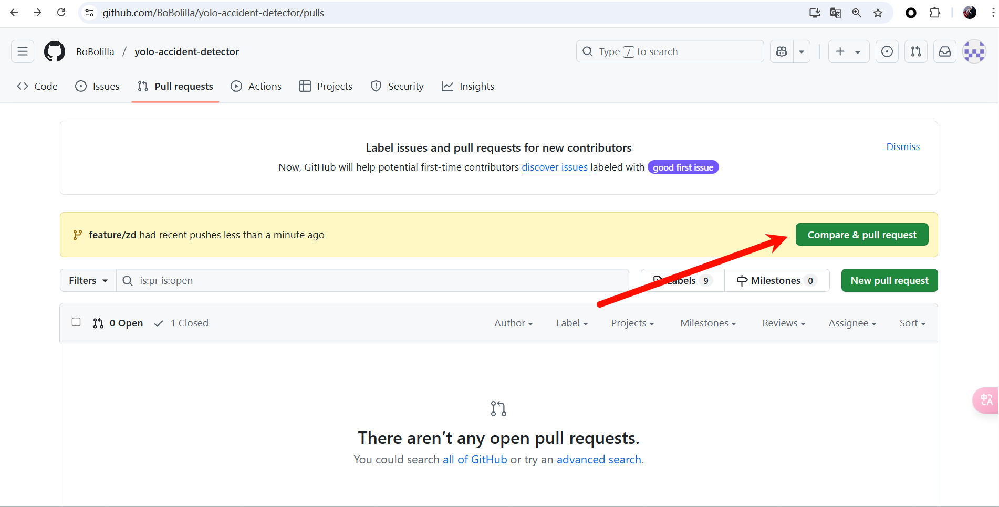
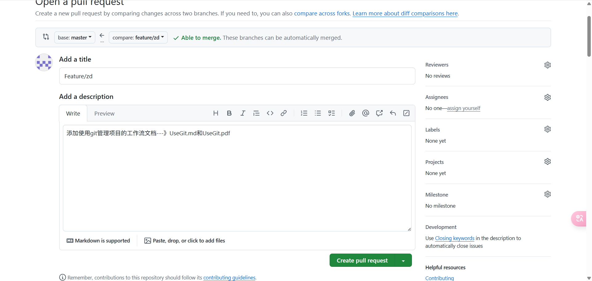

#### 1. 克隆仓库到本地
```bash
git clone git@github.com:BoBolilla/yolo-accident-detector.git
cd yolo-accident-detector
```

#### 2. 创建个人开发分支（每天开始开发前）
```bash
git checkout -b feature/yourname  # 推荐分支命名规范
# 例如：git checkout -b feature/zd
```

#### 3. 开发与本地提交
```bash
# 修改代码后提交
git add .
git commit -m "完成xxx功能（具体描述变更内容）"
```

#### 4. 推送分支到远程
```bash
git push origin feature/yourname
# 例如 git push origin feature/zd
# 首次推送需要加 -u 参数：
git push -u origin feature/yourname
# 例如 git push -u origin feature/zd
```

#### 5. 创建Pull Request（PR）

> ### **PR 就像「代码的请假条」**
>
> 想象小组在共同编辑一份**电子文档**（比如腾讯文档）：
>
> 1. **直接改主文档** ❌
>    - 如果所有人同时乱改，文档会一团糟（代码冲突/错误）
> 2. **PR 的工作方式** ✅
>    - 你：把要改的内容**先复制一份**（你的分支），在自己的副本里修改
>    - 改完后，提交一个「申请」说：*“我改好了，请组长检查一下再合并到主文档”* → 这就是 PR！

- 在GitHub网页端操作

- 选择 `Compare & pull request`

  

- 这里的`compare`选择你自己创建的`feature/yourname`分支对比，对比更改后填写PR描述即可，PR描述就是你负责的部分完成了什么功能，效果怎样

- 关联相关Issue（如有）


#### 6. 代码审查与合并
1. 其他成员审查代码：
   - 在PR页面的Files changed标签页进行行级评论
   - 使用`/test`命令触发CI（如果配置了自动化测试）

2. 合并代码：
```bash
# 当PR通过审查后（组长操作）
git checkout master
git pull origin master  # 确保本地master最新
git merge --no-ff feature/branch-name  # 保留分支历史
git push origin master
```


### 同步最新代码（组员日常操作）
```bash
# 每天开始工作前
git checkout master
git pull origin master

# 回到开发分支合并最新代码
git checkout feature/your-branch
git merge master  # 处理可能出现的冲突
```

---

### 冲突解决流程
当出现冲突时：
```bash
# 查看冲突文件
git status

# 手动编辑标记了<<<<<<<的文件
# 解决后提交
git add .
git commit -m "解决与master分支的合并冲突"
```


### **常用命令速查表**
| 操作 | 命令 |
|------|------|
| 查看分支 | `git branch -av` |
| 删除已合并分支 | `git branch -d branch-name` |
| 暂存修改 | `git stash` |
| 查看远程仓库 | `git remote -v` |
| 撤销本地修改 | `git checkout -- filename` |

使用 `git log --graph --oneline` 查看提交历史
使用 `git shortlog -sn` 查看成员贡献统计。
