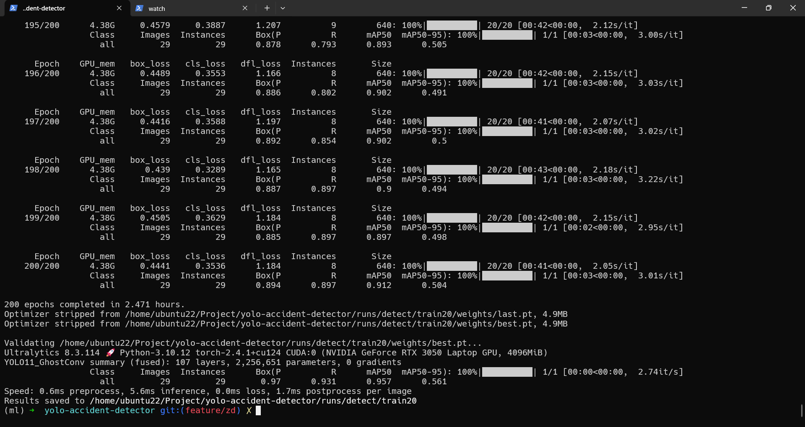
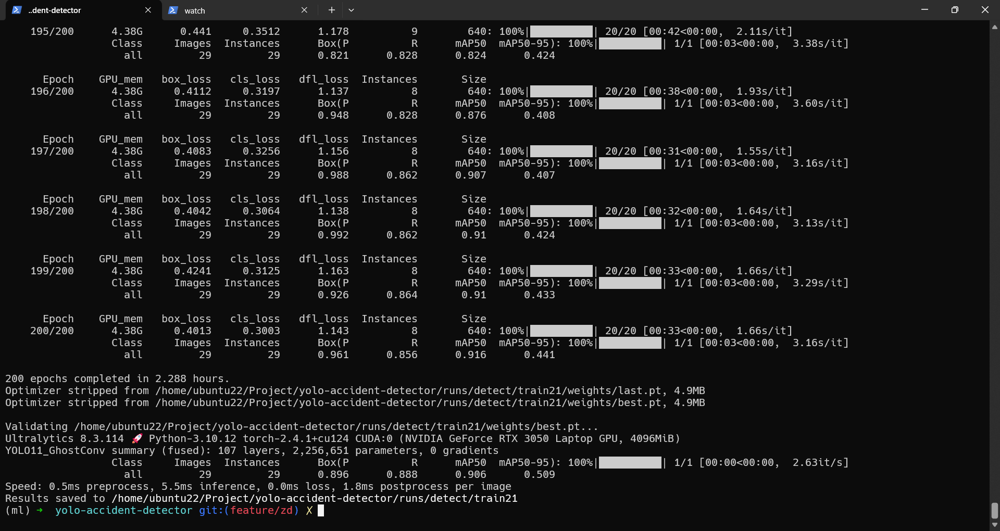

## ATFL自适应阈值焦点损失

[参考视频](https://www.bilibili.com/video/BV1PfyWYoE7J/)

[参考代码](https://github.com/tgf123/YOLOv8_improve/blob/master/yolov8_improve/ATFL.py)

### 修改

`/ultralytics/utils/loss.py`文件中添加

```python
class AdaptiveThresholdFocalLoss(nn.Module):
    # Wraps focal loss around existing loss_fcn(), i.e. criteria = FocalLoss(nn.BCEWithLogitsLoss(), gamma=1.5)
    def __init__(self, loss_fcn, gamma=1.5, alpha=0.25):
        super(AdaptiveThresholdFocalLoss, self).__init__()
        self.loss_fcn = loss_fcn  # must be nn.BCEWithLogitsLoss()
        self.gamma = gamma
        self.alpha = alpha
        # self.reduction = loss_fcn.reduction
        # self.loss_fcn.reduction = 'none'  # required to apply FL to each element

    def forward(self, pred, true):
        loss = self.loss_fcn(pred, true)
        pred_prob = torch.sigmoid(pred)
        p_t = true * pred_prob + (1 - true) * (1 - pred_prob)  # 得出预测概率
        p_t = torch.Tensor(p_t)  # 将张量转化为pytorch张量，使其在pytorch中可以进行张量运算

        mean_pt = p_t.mean()
        p_t_list = []
        p_t_list.append(mean_pt)
        p_t_old = sum(p_t_list) / len(p_t_list)
        p_t_new = 0.05 * p_t_old + 0.95 * mean_pt
        # gamma =2
        gamma = -torch.log(p_t_new)
        # 处理大于0.5的元素
        p_t_high = torch.where(p_t > 0.5, (1.000001 - p_t) ** gamma, torch.zeros_like(p_t))

        # 处理小于0.5的元素
        p_t_low = torch.where(p_t <= 0.5, (1.5 - p_t) ** (-torch.log(p_t)), torch.zeros_like(p_t))  # # 将两部分结果相加
        modulating_factor = p_t_high + p_t_low
        loss *= modulating_factor
        # if self.reduction == 'mean':
        #     return loss.mean()
        # elif self.reduction == 'sum':
        #     return loss.sum()
        # else:  # 'none'
        return loss

```

并在`v8DetectionLoss`类中修改

```python
class v8DetectionLoss:
    """Criterion class for computing training losses for YOLOv8 object detection."""

    def __init__(self, model, tal_topk=10):  # model must be de-paralleled
        """Initialize v8DetectionLoss with model parameters and task-aligned assignment settings."""
        device = next(model.parameters()).device  # get model device
        h = model.args  # hyperparameters

        m = model.model[-1]  # Detect() module
        self.bce = nn.BCEWithLogitsLoss(reduction="none")
        # 这里添加
        self.hyp = h
        self.stride = m.stride  # model strides
        self.nc = m.nc  # number of classes
        self.no = m.nc + m.reg_max * 4
        self.reg_max = m.reg_max
        self.device = device

        self.use_dfl = m.reg_max > 1

        self.assigner = TaskAlignedAssigner(topk=tal_topk, num_classes=self.nc, alpha=0.5, beta=6.0)
        self.bbox_loss = BboxLoss(m.reg_max).to(device)
        self.proj = torch.arange(m.reg_max, dtype=torch.float, device=device)
```

为

```python
class v8DetectionLoss:
    """Criterion class for computing training losses for YOLOv8 object detection."""

    def __init__(self, model, tal_topk=10):  # model must be de-paralleled
        """Initialize v8DetectionLoss with model parameters and task-aligned assignment settings."""
        device = next(model.parameters()).device  # get model device
        h = model.args  # hyperparameters

        m = model.model[-1]  # Detect() module
        self.bce = nn.BCEWithLogitsLoss(reduction="none")
        # 这里添加
        # Focal loss
        g = 1  # focal loss gamma
        if g > 0:
            self.bce = AdaptiveThresholdFocalLoss(self.bce, g)
            
        self.hyp = h
        self.stride = m.stride  # model strides
        self.nc = m.nc  # number of classes
        self.no = m.nc + m.reg_max * 4
        self.reg_max = m.reg_max
        self.device = device

        self.use_dfl = m.reg_max > 1

        self.assigner = TaskAlignedAssigner(topk=tal_topk, num_classes=self.nc, alpha=0.5, beta=6.0)
        self.bbox_loss = BboxLoss(m.reg_max).to(device)
        self.proj = torch.arange(m.reg_max, dtype=torch.float, device=device)
```

### 结果



```
(ml) ➜  yolo-accident-detector git:(feature/zd) ✗ python yolo11_GhostConv_train.py
WARNING ⚠️ no model scale passed. Assuming scale='n'.
Transferred 457/541 items from pretrained weights
Ultralytics 8.3.114 🚀 Python-3.10.12 torch-2.4.1+cu124 CUDA:0 (NVIDIA GeForce RTX 3050 Laptop GPU, 4096MiB)
engine/trainer: task=detect, mode=train, model=ultralytics/cfg/models/11/yolo11_GhostConv.yaml, data=accident.yaml, epochs=200, time=None, patience=100, batch=16, imgsz=640, save=True, save_period=-1, cache=False, device=0, workers=2, project=None, name=train20, exist_ok=False, pretrained=yolo11n.pt, optimizer=SGD, verbose=True, seed=0, deterministic=True, single_cls=False, rect=False, cos_lr=False, close_mosaic=10, resume=False, amp=False, fraction=1.0, profile=False, freeze=None, multi_scale=False, overlap_mask=True, mask_ratio=4, dropout=0.0, val=True, split=val, save_json=False, conf=None, iou=0.7, max_det=300, half=False, dnn=False, plots=True, source=None, vid_stride=1, stream_buffer=False, visualize=False, augment=False, agnostic_nms=False, classes=None, retina_masks=False, embed=None, show=False, save_frames=False, save_txt=False, save_conf=False, save_crop=False, show_labels=True, show_conf=True, show_boxes=True, line_width=None, format=torchscript, keras=False, optimize=False, int8=False, dynamic=False, simplify=True, opset=None, workspace=None, nms=False, lr0=0.01, lrf=0.01, momentum=0.937, weight_decay=0.0005, warmup_epochs=3.0, warmup_momentum=0.8, warmup_bias_lr=0.1, box=7.5, cls=0.5, dfl=1.5, pose=12.0, kobj=1.0, nbs=64, hsv_h=0.015, hsv_s=0.7, hsv_v=0.4, degrees=0.0, translate=0.1, scale=0.5, shear=0.0, perspective=0.0, flipud=0.0, fliplr=0.5, bgr=0.0, mosaic=1.0, mixup=0.0, copy_paste=0.0, copy_paste_mode=flip, auto_augment=randaugment, erasing=0.4, cfg=None, tracker=botsort.yaml, save_dir=/home/ubuntu22/Project/yolo-accident-detector/runs/detect/train20
Overriding model.yaml nc=80 with nc=1
WARNING ⚠️ no model scale passed. Assuming scale='n'.

                   from  n    params  module                                       arguments
  0                  -1  1       448  ultralytics.nn.modules.conv.GhostConv        [3, 16, 3, 2]
  1                  -1  1      2768  ultralytics.nn.modules.conv.GhostConv        [16, 32, 3, 2]
  2                  -1  1      6640  ultralytics.nn.modules.block.C3k2            [32, 64, 1, False, 0.25]
  3                  -1  1     19360  ultralytics.nn.modules.conv.GhostConv        [64, 64, 3, 2]
  4                  -1  1     26080  ultralytics.nn.modules.block.C3k2            [64, 128, 1, False, 0.25]
  5                  -1  1     75584  ultralytics.nn.modules.conv.GhostConv        [128, 128, 3, 2]
  6                  -1  1     87040  ultralytics.nn.modules.block.C3k2            [128, 128, 1, True]
  7                  -1  1    151168  ultralytics.nn.modules.conv.GhostConv        [128, 256, 3, 2]
  8                  -1  1    346112  ultralytics.nn.modules.block.C3k2            [256, 256, 1, True]
  9                  -1  1    164608  ultralytics.nn.modules.block.SPPF            [256, 256, 5]
 10                  -1  1    249728  ultralytics.nn.modules.block.C2PSA           [256, 256, 1]
 11                  -1  1         0  torch.nn.modules.upsampling.Upsample         [None, 2, 'nearest']
 12             [-1, 6]  1         0  ultralytics.nn.modules.conv.Concat           [1]
 13                  -1  1    111296  ultralytics.nn.modules.block.C3k2            [384, 128, 1, False]
 14                  -1  1         0  torch.nn.modules.upsampling.Upsample         [None, 2, 'nearest']
 15             [-1, 4]  1         0  ultralytics.nn.modules.conv.Concat           [1]
 16                  -1  1     32096  ultralytics.nn.modules.block.C3k2            [256, 64, 1, False]
 17                  -1  1     19360  ultralytics.nn.modules.conv.GhostConv        [64, 64, 3, 2]
 18            [-1, 13]  1         0  ultralytics.nn.modules.conv.Concat           [1]
 19                  -1  1     86720  ultralytics.nn.modules.block.C3k2            [192, 128, 1, False]
 20                  -1  1     75584  ultralytics.nn.modules.conv.GhostConv        [128, 128, 3, 2]
 21            [-1, 10]  1         0  ultralytics.nn.modules.conv.Concat           [1]
 22                  -1  1    378880  ultralytics.nn.modules.block.C3k2            [384, 256, 1, True]
 23        [16, 19, 22]  1    430867  ultralytics.nn.modules.head.Detect           [1, [64, 128, 256]]
YOLO11_GhostConv summary: 195 layers, 2,264,339 parameters, 2,264,323 gradients

Transferred 490/541 items from pretrained weights
Freezing layer 'model.23.dfl.conv.weight'
train: Fast image access ✅ (ping: 0.0±0.0 ms, read: 394.3±91.0 MB/s, size: 66.7 KB)
train: Scanning /home/ubuntu22/Project/datasets/Accident_Detection.v1i.yolov8/train/labels.cache... 312 images, 0 backgrounds, 0 corrupt: 100%|██████████| 3
val: Fast image access ✅ (ping: 0.1±0.1 ms, read: 101.5±17.3 MB/s, size: 66.1 KB)
val: Scanning /home/ubuntu22/Project/datasets/Accident_Detection.v1i.yolov8/valid/labels.cache... 29 images, 0 backgrounds, 0 corrupt: 100%|██████████| 29/2
Plotting labels to /home/ubuntu22/Project/yolo-accident-detector/runs/detect/train20/labels.jpg...
optimizer: SGD(lr=0.01, momentum=0.937) with parameter groups 88 weight(decay=0.0), 95 weight(decay=0.0005), 94 bias(decay=0.0)
Image sizes 640 train, 640 val
Using 2 dataloader workers
Logging results to /home/ubuntu22/Project/yolo-accident-detector/runs/detect/train20
Starting training for 200 epochs...

      Epoch    GPU_mem   box_loss   cls_loss   dfl_loss  Instances       Size
      1/200      4.34G       2.76      3.534      3.037         24        640: 100%|██████████| 20/20 [00:43<00:00,  2.19s/it]
                 Class     Images  Instances      Box(P          R      mAP50  mAP50-95): 100%|██████████| 1/1 [00:06<00:00,  6.11s/it]
                   all         29         29    0.00299      0.897      0.159      0.036

      Epoch    GPU_mem   box_loss   cls_loss   dfl_loss  Instances       Size
      2/200      4.37G      2.512      3.445      2.804         22        640: 100%|██████████| 20/20 [00:46<00:00,  2.35s/it]

      Epoch    GPU_mem   box_loss   cls_loss   dfl_loss  Instances       Size
    200/200      4.38G     0.4441     0.3536      1.184          8        640: 100%|██████████| 20/20 [00:41<00:00,  2.05s/it]
                 Class     Images  Instances      Box(P          R      mAP50  mAP50-95): 100%|██████████| 1/1 [00:03<00:00,  3.01s/it]
                   all         29         29      0.894      0.897      0.912      0.504

200 epochs completed in 2.471 hours.
Optimizer stripped from /home/ubuntu22/Project/yolo-accident-detector/runs/detect/train20/weights/last.pt, 4.9MB
Optimizer stripped from /home/ubuntu22/Project/yolo-accident-detector/runs/detect/train20/weights/best.pt, 4.9MB

Validating /home/ubuntu22/Project/yolo-accident-detector/runs/detect/train20/weights/best.pt...
Ultralytics 8.3.114 🚀 Python-3.10.12 torch-2.4.1+cu124 CUDA:0 (NVIDIA GeForce RTX 3050 Laptop GPU, 4096MiB)
YOLO11_GhostConv summary (fused): 107 layers, 2,256,651 parameters, 0 gradients
                 Class     Images  Instances      Box(P          R      mAP50  mAP50-95): 100%|██████████| 1/1 [00:00<00:00,  2.74it/s]
                   all         29         29       0.97      0.931      0.957      0.561
Speed: 0.6ms preprocess, 5.6ms inference, 0.0ms loss, 1.7ms postprocess per image
Results saved to /home/ubuntu22/Project/yolo-accident-detector/runs/detect/train20
```



```
    195/200      4.38G      0.441     0.3512      1.178          9        640: 100%|██████████| 20/20 [00:42<00:00,  2.11s/it]
                 Class     Images  Instances      Box(P          R      mAP50  mAP50-95): 100%|██████████| 1/1 [00:03<00:00,  3.38s/it]
                   all         29         29      0.821      0.828      0.824      0.424

      Epoch    GPU_mem   box_loss   cls_loss   dfl_loss  Instances       Size
    196/200      4.38G     0.4112     0.3197      1.137          8        640: 100%|██████████| 20/20 [00:38<00:00,  1.93s/it]
                 Class     Images  Instances      Box(P          R      mAP50  mAP50-95): 100%|██████████| 1/1 [00:03<00:00,  3.60s/it]
                   all         29         29      0.948      0.828      0.876      0.408

      Epoch    GPU_mem   box_loss   cls_loss   dfl_loss  Instances       Size
    197/200      4.38G     0.4083     0.3256      1.156          8        640: 100%|██████████| 20/20 [00:31<00:00,  1.55s/it]
                 Class     Images  Instances      Box(P          R      mAP50  mAP50-95): 100%|██████████| 1/1 [00:03<00:00,  3.16s/it]
                   all         29         29      0.988      0.862      0.907      0.407

      Epoch    GPU_mem   box_loss   cls_loss   dfl_loss  Instances       Size
    198/200      4.38G     0.4042     0.3064      1.138          8        640: 100%|██████████| 20/20 [00:32<00:00,  1.64s/it]
                 Class     Images  Instances      Box(P          R      mAP50  mAP50-95): 100%|██████████| 1/1 [00:03<00:00,  3.13s/it]
                   all         29         29      0.992      0.862       0.91      0.424

      Epoch    GPU_mem   box_loss   cls_loss   dfl_loss  Instances       Size
    199/200      4.38G     0.4241     0.3125      1.163          8        640: 100%|██████████| 20/20 [00:33<00:00,  1.66s/it]
                 Class     Images  Instances      Box(P          R      mAP50  mAP50-95): 100%|██████████| 1/1 [00:03<00:00,  3.29s/it]
                   all         29         29      0.926      0.864       0.91      0.433

      Epoch    GPU_mem   box_loss   cls_loss   dfl_loss  Instances       Size
    200/200      4.38G     0.4013     0.3003      1.143          8        640: 100%|██████████| 20/20 [00:33<00:00,  1.66s/it]
                 Class     Images  Instances      Box(P          R      mAP50  mAP50-95): 100%|██████████| 1/1 [00:03<00:00,  3.16s/it]
                   all         29         29      0.961      0.856      0.916      0.441

200 epochs completed in 2.288 hours.
Optimizer stripped from /home/ubuntu22/Project/yolo-accident-detector/runs/detect/train21/weights/last.pt, 4.9MB
Optimizer stripped from /home/ubuntu22/Project/yolo-accident-detector/runs/detect/train21/weights/best.pt, 4.9MB

Validating /home/ubuntu22/Project/yolo-accident-detector/runs/detect/train21/weights/best.pt...
Ultralytics 8.3.114 🚀 Python-3.10.12 torch-2.4.1+cu124 CUDA:0 (NVIDIA GeForce RTX 3050 Laptop GPU, 4096MiB)
YOLO11_GhostConv summary (fused): 107 layers, 2,256,651 parameters, 0 gradients
                 Class     Images  Instances      Box(P          R      mAP50  mAP50-95): 100%|██████████| 1/1 [00:00<00:00,  2.63it/s]
                   all         29         29      0.896      0.888      0.906      0.509
Speed: 0.5ms preprocess, 5.5ms inference, 0.0ms loss, 1.8ms postprocess per image
Results saved to /home/ubuntu22/Project/yolo-accident-detector/runs/detect/train21
```

### 提升

| 指标项           | 无 ATFL (train21) | 有 ATFL (train20) | 差异           |
| ---------------- | ----------------- | ----------------- | -------------- |
| **Box(P)**       | 0.896             | 0.97              | ↑ 提升了 0.074 |
| **Recall (R)**   | 0.888             | 0.931             | ↑ 提升了 0.043 |
| **mAP@0.5**      | 0.906             | 0.957             | ↑ 提升了 0.051 |
| **mAP@0.5:0.95** | 0.509             | 0.561             | ↑ 提升了 0.052 |